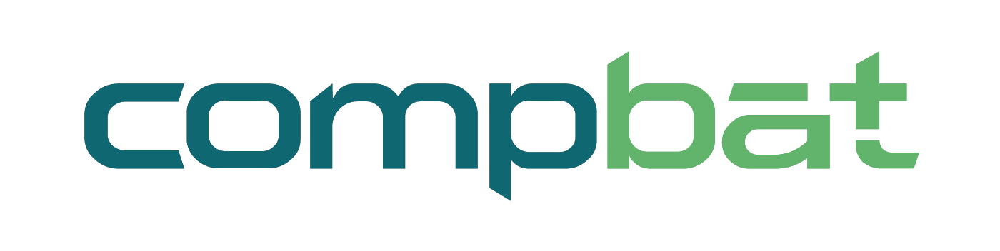

# PredPotS

**PredPotS** is a web application designed to predict one electron reduction potential in aqueous environment using machine learning models trained on chemical data.

The live web app is available here: [PredPotS Web Application](https://predpots.ttk.hu/)  

## This GitHub Repository

This repository contains resources related to the underlying data and ML models powering PredPotS, including:

- **`data/`**: Contains the datasets  
  - `Datasets/` with CSV files of molecular data  
  - `xyz_files/` with zipped XYZ geometry files  

- **`model_training/`**: Python code used for training the machine learning models that are deployed in the backend of the web application.

For detailed explanations please refer to the  [PredPotS Web Application](https://predpots.ttk.hu/) or the related [publication](YOUR_PAPER_LINK).

<table>
  <tr>
    <td width="150">
      
    </td>
    <td>
    This project has received funding from the European Union's Horizon 2020 research and innovation programme under grant agreement No 875565.
    The content on this website represents the views of the authors, and the European Commission has no liability in respect of the content.
    </td>
    <td width="120" align="right">
      
    </td>
  </tr>
</table>

