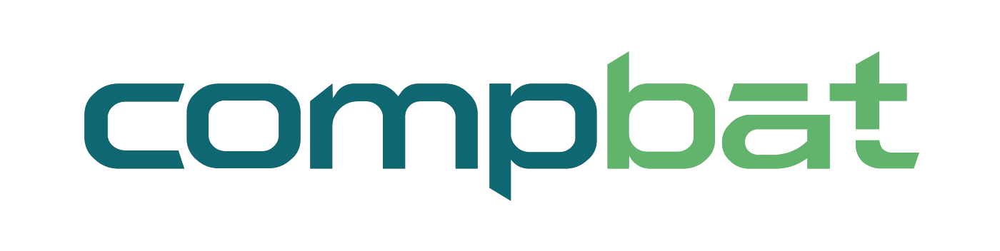

# PredPotS

**PredPotS** is a web application designed to predict one electron reduction potential in aqueous environment using machine learning models trained on chemical data.

The live web app is available here: [PredPotS Web Application](https://predpots.ttk.hu/)  

# Data Folder

This folder contains datasets used for training and testing machine learning models in the **PredPotS** project.

## Structure

- **`Datasets/`**  
  Contains CSV files with molecular data including SMILES strings, identifiers, and target values (e.g., reduction potentials).

- **`xyz_files/`**  
  Contains zipped `.xyz` optimized geometry files for the corresponding molecules.

<table>
  <tr>
    <td width="150">
      
    </td>
    <td>
    This project has received funding from the European Union's Horizon 2020 research and innovation programme under grant agreement No 875565.
    The content on this website represents the views of the authors, and the European Commission has no liability in respect of the content.
    </td>
    <td width="120" align="right">
      
    </td>
  </tr>
</table>

